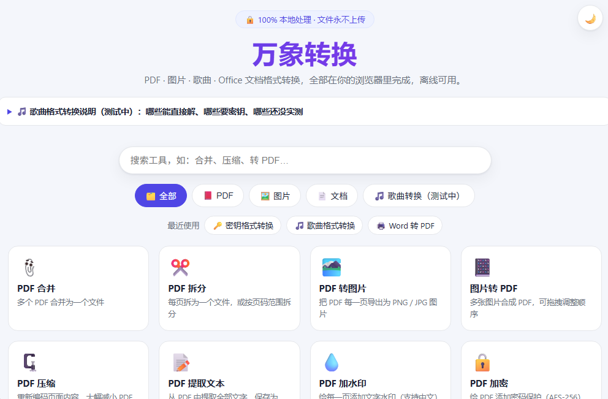
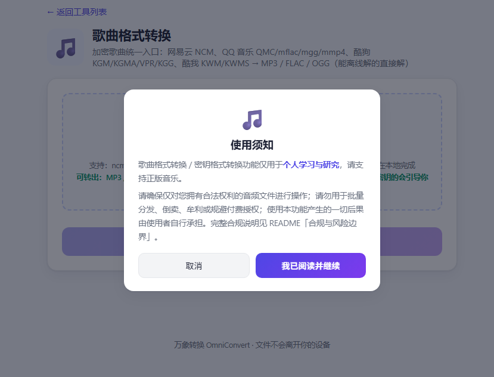

# OmniConvert 万象转换

[中文](README.md) | **English**

A BentoPDF / Stirling-PDF style file conversion tool that runs **entirely in your browser** — files never leave your device.

**Zero backend. Zero upload. Works offline (PWA).** Works on both desktop and mobile browsers. Also ships as a Windows desktop app (Tauri) and a WeChat Mini Program skeleton.

<p align="center">
  
</p>

<p align="center">
  
</p>

> The collapsible panel at the top of the home page spells out **which formats decrypt offline**, **which need a key and how to obtain it per platform**, and **which ones still lack real samples and are untested**.

## Quick Start

**Just want the desktop app? [Download from Releases](https://github.com/Fatallove101/omniconvert/releases/latest)**:
- [Installer OmniConvert_v0.5.0_x64-setup.exe](https://github.com/Fatallove101/omniconvert/releases/download/v0.5.0/OmniConvert_v0.5.0_x64-setup.exe) (setup wizard + Start menu + uninstaller)
- [Portable OmniConvert_v0.5.0_x64-portable.exe](https://github.com/Fatallove101/omniconvert/releases/download/v0.5.0/OmniConvert_v0.5.0_x64-portable.exe) (run it directly, no install)

> Version history lives in [Releases](https://github.com/Fatallove101/omniconvert/releases) — every version carries its own changelog (full iteration record since v0.1.0).

```
Double-click start.bat
→ starts a local server and opens http://localhost:8137
```

Or manually: `powershell -ExecutionPolicy Bypass -File server.ps1` (zero-dependency static server, no admin rights needed).

- **Mobile**: connect your phone to the same Wi-Fi, change the listener in `server.ps1` to `IPAddress.Any`, allow port 8137 in the firewall, then visit `http://<PC-IP>:8137`
- **Production**: the whole directory is pure static files — host it on GitHub Pages / Cloudflare Pages / EdgeOne Pages / Nginx for free

## Features (25 tools)

| Category | Tool | Description |
| --- | --- | --- |
| PDF | Merge | Combine multiple PDFs into one |
| PDF | Split | One file per page / custom ranges (`1-3,5`) / every N pages |
| PDF | To Image | Export each page as PNG/JPG at 96/150/300 DPI |
| PDF | To PPT | Image-based PPTX, each page full-bleed on a slide (layout preserved) |
| PDF | To Word | Image-based (layout preserved) or text-based (editable) docx |
| PDF | Flatten | Re-pack every page as a full-page image (prevents copy/edit) |
| PDF | Images to PDF | Merge images into a PDF with drag-and-drop ordering, rotation, removal |
| PDF | Compress | Re-encode pages, best for scanned/image-heavy PDFs |
| PDF | Extract Text | Export text as TXT (scanned pages need OCR — not yet) |
| PDF | Watermark | Text watermark with Chinese support, opacity, angle |
| PDF | Organize | Thumbnail drag-to-reorder, delete/rotate pages |
| PDF | Encrypt | Password protection (AES-256, qpdf WASM) |
| PDF | Decrypt | Remove password protection (requires the password) |
| PDF | Rotate | Rotate all or selected pages |
| Image | Convert | JPG / PNG / WebP / HEIC / BMP conversion |
| Image | Compress | Quality + max-edge control, shows savings |
| Image | Resize | By percentage or exact width/height |
| Image | HEIC to JPG | iPhone photos to universal formats |
| Image | ICO Generator | Multi-size Windows / favicon icons (16–256) |
| Music (beta) | Song Conversion | **Single entry point for encrypted songs**: NetEase NCM, QQ Music QMC/mflac/mgg/mmp4, KuGou KGM/KGMA/VPR/KGG, Kuwo KWM/KWMS → MP3/FLAC/OGG. It tries the offline decryption first, and when a key is required it offers a button to continue in "Key-based Conversion" **carrying your files over** |
| Music (beta) | Key-based Conversion | Formats whose **extension cannot tell** whether a key is needed (KuGou KGG/KGM/KGMA/VPR, QQ Music mflac/mgg/mmp4, Kuwo kwm/kwms): offline-capable variants decrypt directly, otherwise the dialog explains how to obtain the key per platform. Legacy link `#/tool/kgg-convert` still works |
| Document | Word to PDF | Renders docx then opens the print dialog — "Save as PDF" |
| Document | Excel ↔ CSV | xlsx/xls ↔ csv, direction auto-detected |
| Document | Word to HTML | docx → styled HTML page or plain text |
| Document | Markdown to HTML | Standalone styled web page |

> **Scope of music conversion**: this is *decryption* — it removes the encryption wrapper and recovers the audio file stored inside (lossless, format unchanged). It does **not** transcode (e.g. FLAC→MP3 needs an audio encoder, which this project does not bundle).
>
> The two music tools work together: **"Song Conversion" is the single entry point** — it accepts **every** encrypted-song format, tries offline decryption itself, and if a per-song key is required it shows a "go to Key-based Conversion" button that **carries your files along**; **"Key-based Conversion"** focuses on those formats whose extension cannot tell whether a key is needed and shows the per-platform key dialog:
>
> | Platform | Formats | Extension tells? | Offline? | When a key is needed |
> | --- | --- | --- | --- | --- |
> | NetEase | ncm | yes (always offline) | ✅ key embedded | n/a |
> | QQ Music | qmc0/qmc3/qmcflac/qmcogg/qmcm | yes (always offline) | ✅ static map | n/a |
> | KuGou | kgm/kgma/vpr | **no** | ✅ v1/v2 key in header, v3 built-in decoder + offline public key | the rare v5 variant: use Key-based Conversion + eKey / key store |
> | KuGou | kgg | **no** | v3 offline | v5: pick the `KGMusicV3.db` key store for automatic extraction, or paste the eKey |
> | QQ Music | mflac/mgg/mgg1/mmp4 | **no** | footer with plaintext eKey decrypts | the **`musicex` footer contains no eKey**: client-side export (the client's own convert/export, or a desktop tool doing runtime decryption while QQ Music runs), or paste that song's eKey |
> | Kuwo | kwm/kwms | **no** | v1 offline | v2/kwms: paste the eKey obtained from the client (a **best-effort** attempt via the Kuwo v2 key path that fails loudly) |
>
> **Everything is decided from the file content, never from the extension**: KuGou by the version number in the header (same `.kgma`, v1/v2/v3 decrypt, only v5 asks), QQ by the footer layout, Kuwo by trial-decrypting once. Without a key you always get a clear error explaining why — never an unplayable file. Only convert songs you are legally entitled to.

### UX details

- **Result preview drawer**: preview images / first PDF page / text content without downloading (bottom sheet on mobile), one-click copy for text results
- **Dark mode**: toggle in the top-right corner, follows system + remembers your choice
- **Option memory**: every tool remembers your last settings
- **Recent tools**: quick access chips on the home page
- **PWA**: installable on desktop / home screen, works offline

## Architecture

```
omniconvert/
├── index.html            # Single-page app entry
├── css/app.css           # Responsive styles (mobile-first, dark mode)
├── js/
│   ├── app.js            # Framework: tool registry, hash router, UI, progress/download/zip
│   ├── ooxml.js          # Minimal OOXML (docx) writer for PDF→Word
│   ├── kgg-decoder.js    # KGG v3 decoder (constants extracted from TriAgent)
│   ├── kgg-db.js         # KGMusicV3.db decryption + key extraction
│   ├── md5.js / aes.js   # Pure-JS MD5 / AES-128-CBC (no-padding) for the key db
│   └── tools/            # Tool implementations (auto-registered)
│       ├── pdf-tools.js  ├── image-tools.js
│       ├── doc-tools.js  └── music-tools.js
├── vendor/               # Local conversion engines (offline-capable)
│   ├── pdf-lib / pdf.js / qpdf WASM / SheetJS / mammoth / marked / heic2any
│   ├── pptx/             # pptxgenjs (PPTX writer)
│   ├── um/               # unlock-music WASM + KGG public key prefix
│   └── sqljs/            # sql.js (read the KuGou key database)
├── docs/screenshots/     # README screenshots (not shipped in the build)
├── miniprogram/          # WeChat Mini Program skeleton (see its README)
├── src-tauri/            # Windows desktop app (Tauri v2)
├── server.ps1            # Zero-dependency local static server (TcpListener)
├── start.bat             # One-click launcher
└── test/                 # Fixture generator + self-test suites
```

**How it works**: all conversions run in your browser — PDF writing via pdf-lib, PDF rendering via pdf.js (Web Worker), images via Canvas, spreadsheets via SheetJS, music decryption via the unlock-music WASM. Files only ever live in memory; nothing is uploaded.

**Adding a tool**: call `App.registerTool({ id, name, desc, icon, category, accept, multiple, options, run })` in `js/tools/` — the home grid, routing, progress bar, preview and download/zip all come for free.

## Product guide

### Delivery formats

| Form | How to get it | Notes |
| --- | --- | --- |
| Web app (local) | Double-click `start.bat`, or run `server.ps1` yourself | Zero-dependency local static server, open `http://localhost:8137` |
| Web app (public) | Host the plain static directory on GitHub Pages / Nginx / object storage + CDN | No backend, no database, no server cost |
| PWA | "Install app / Add to home screen" in the browser | `sw.js` caches the app shell, works offline |
| Windows desktop app | [Download from Releases](https://github.com/Fatallove101/omniconvert/releases/latest) — installer or portable | Tauri + WebView2 shell wrapping the same frontend, still zero upload |
| WeChat Mini Program | `miniprogram/` skeleton | In-app Canvas + pdf-lib; heavy work goes to a cloud function (see `miniprogram/README.md`) |

### 1. How the Windows desktop app is built

The desktop build is **not a second codebase**: `make-dist.ps1` copies the static assets into `dist/`, Tauri embeds `dist/` into the shell, and the window loads those local files through WebView2 — so every conversion still happens 100% on the machine.

1. Requirements: Rust (MSVC toolchain) + Node.js + VS Build Tools (C++ workload; `install-buildtools.bat` installs it in one click)
2. Build (the order actually used and tested here):

   ```
   npm install
   powershell -ExecutionPolicy Bypass -File make-dist.ps1   # copy clean static assets to dist/
   npm run tauri build
   ```

3. Two artifacts:
   - **Portable**: `src-tauri/target/release/omniconvert.exe` (~10 MB, run it directly, no console window)
   - **Installer**: `src-tauri/target/release/bundle/nsis/*-setup.exe` (NSIS wizard with Start menu entry and uninstaller)

Packaging details and pitfalls (all of them encoded in the source):

- **Icons**: replace `assets/icons/icon-512.png`, then run `npm run tauri icon` to regenerate `ico` / `icns` and every PNG size
- **WebView2 runtime**: `webviewInstallMode = downloadBootstrapper` in `src-tauri/tauri.conf.json` downloads the runtime during setup, which keeps the installer a few MB
- **The desktop build never registers a Service Worker**: a stale SW on `tauri.localhost` hijacks navigation (its internal fetch gets DNS-poisoned on some networks) and whitescreens the window. `js/app.js` therefore unregisters any SW and clears caches when it detects Tauri, and `src-tauri/src/main.rs` points the WebView2 user-data folder at `%LOCALAPPDATA%\OmniConvert\WebView2` to start clean
- **Frontend changes require a rebuild**: run `make-dist.ps1` first, then `npm run tauri build`. `dist/` is a build output and is not committed
- **One-command release**: `node test/make-releases.mjs --release v0.5.1 --assets "installer;portable"` — reads the token from Git Credential Manager, creates/updates the Release, generates the changelog from git history, and uploads both exes. Extra modes: `--backfill-missing` (create releases for old tags), `--refresh-notes` (regenerate notes), `--mark-old` (banner + pre-release flag on older versions so only the newest keeps the Latest badge)

### 2. Local deployment and browser access

```
Double-click start.bat
→ starts the local server in a minimized window and opens http://localhost:8137
```

Or manually, with configurable port and root:

```
powershell -ExecutionPolicy Bypass -File server.ps1                            # default port 8137
powershell -ExecutionPolicy Bypass -File server.ps1 -Port 9000                 # custom port
powershell -ExecutionPolicy Bypass -File server.ps1 -Root D:\www\omniconvert   # custom site root
```

`server.ps1` is a zero-dependency TcpListener static server: no admin rights, no IIS / Nginx / Node required. It only does a few things — correct MIME types by extension (including the `.mjs` and `.wasm` needed for packaging), `Cache-Control: no-cache` so edits show up on refresh, directory-traversal protection (403 for anything outside the root), and serving `index.html` for `/`. Close the minimized PowerShell window to stop the server.

- **Mobile / tablet**: put the phone on the same Wi-Fi, change the listener in `server.ps1` to `IPAddress.Any`, allow port 8137 in the firewall, then visit `http://<PC-IP>:8137`
- **Public hosting**: apart from `src-tauri/`, `test/` and `miniprogram/`, the whole directory is plain static files — drop it on GitHub Pages / Nginx / object storage + CDN. After updating, bump the `CACHE` version in `sw.js` or returning visitors keep the old build
- **Offline use**: after the first visit the Service Worker caches the app shell listed in `ASSETS` inside `sw.js`; if you add static files, add them there and bump the version

### Known boundaries

- Music conversion is decryption only — no lossy transcoding (FLAC→MP3 would need an audio encoder, not bundled)
- Formats that may need a key go through **Key-based Conversion**: KuGou KGG/KGM/KGMA/VPR, QQ Music mflac/mgg/mmp4, Kuwo kwm/kwms. "Song Conversion" also accepts them, tries offline first, and on failure shows a button to continue in the key tool (files carried over)
- The newer QQ Music footer (`musicex`) and Kuwo v2/kwms keep their key outside the file: a browser page cannot reach the key inside the running client, so use a **client-side export** or paste that song's eKey (Kuwo v2 is best-effort). Without one you get a clear error instead of an unplayable file
- **Not yet tested (no real samples — may simply not work)**: QQ Music `mmp4`, Kuwo `kwm` v2 / `kwms`, and the "paste an eKey and decrypt successfully" paths (only the wrong-key error path is verified so far). Verified with real files: KuGou `kgm/kgma` offline decryption, and KuGou `kgg` v5 with the eKey auto-extracted from `KGMusicV3.db`. NetEase `ncm` and legacy QQ QMC are guaranteed by the engine but had no sample on the dev machine
- OCR for scanned PDFs, and the high fidelity of PDF→Word/PPT/Excel, require heavy engines such as Tesseract or LibreOffice — this project stays browser-only and ships none of them

## Compliance & Risk Boundary

> The following is an engineering compliance statement, not legal advice.

You should only use this project under these premises:

- Only process **local files that you personally have lawful access to**;
- Verify on your own that your usage complies with local laws, copyright rules, platform agreements, and organizational policies.

Do not use this project for:

- Bulk distribution, resale, monetization;
- Circumventing paid licensing.

This project makes no promises regarding:

- Suitability for any specific region, platform rules, or purpose;
- Compliance with the regulations of your jurisdiction;
- Readiness of any specific commercial use;
- Liability for user infringement, breach of contract, or rule violations.

## Privacy

All conversions happen inside your browser. Nothing is collected, nothing is uploaded. The Service Worker only caches app code for offline use.

## License & Attribution

- App code: MIT
- Conversion engines keep their own licenses: pdf-lib, pdf.js, SheetJS, mammoth, marked, heic2any, pptxgenjs, qpdf (Apache-2.0), unlock-music WASM (MIT OR Apache-2.0)
- KGG v3 decoder is ported from [TriAgent](https://github.com/Acooldog/TriAgent) (GPL-3.0) — if you distribute this project publicly, the GPL obligation applies to the whole work

## Testing

Node self-test suites (zero dependencies — they drive the repo's own `vendor/um/loader-inline.js` as the engine):

- `node test/check-music.mjs <file-or-dir>` — **music health check**: classifies every encrypted song as `✅ offline` / `🔑 key required` / `❓ unknown` / `⛔ unsupported` and prints where to get the key for that platform; covers ncm, qmc*, mflac/mgg/mmp4, kgm/kgma/kgg/vpr, kwm/kwms (KuGou is judged by the version inside the file: v1/v2/v3 show ✅, only v5 shows 🔑)
- `node test/test-qmc-mgg.mjs` — key flows and output self-check (never silently writes an unplayable file)
- `node test/test-key-tool.mjs` — the "Key-based Conversion" tool layer (legacy link, extension grouping, per-platform prompts)
- `node test/test-state-sharing.mjs` — framework/tool state sharing (page reorder, image ordering)
- `node test/test-kggdb.mjs`, `node test/test-v5.mjs` — key-store decryption and the KGG v5 flow
- `test/check-ooxml.ps1`, `test/make-fixtures.ps1` — OOXML well-formedness and fixture generation
